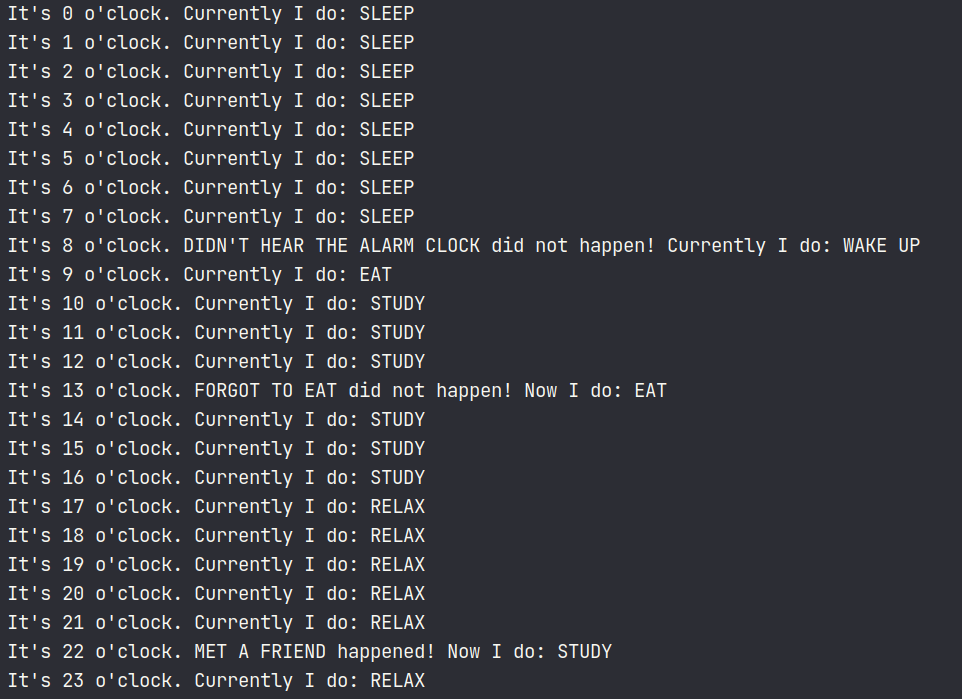

# FSM_My_Ordinary_Day

Finite State Machines (shortly FSM) proved to be useful in helping simulating tough processes, where human brain is
inferior. FSM is perfect for any kind of simulation either it's reading regex or simulation an every day life. Here
we held a research on how FSM can assist in simulating (sorry for repetitions) a single day in my life.
---
## §1 - Set up project
To begin with, we initialise all possible states we can be in, such as **_sleeping_**, **_waking up_**, **_eating_**,
**_studying_** and **_relaxing_**. Also we add some random events - life is unpredictable - so that we might enter
some states multiple times throughout the day. In current project these random events are **_skipping the alarm clock_**,
**_forgetting to eat_** and **_meeting friends_** (yeah, life is harsh).

As you could notice, the graph in the beginning is a graphical representations of these states and possible events,
where nodes represent states and edges are "transitions" or events (an hour passed, random event happened, etc).

So, let me explain what text near edges actually means:
1. 1 hour = 1 hour passes
2. smth (0) = an event did not happen
3. smth (1) = an event happened
4. overslept, 1 hour = in case alarm clock can no longer be triggered, wake up immediately and run to study

## §2 - Results examples
After we set up the project and wrote a lot of code, we can finally spectate the results we sought. Our FSM will
output everything we do at the specific hour and also notify whether a random event happened and what we do after.

We made 3 runs (although we could do more), so we can see how each day may differ. As you may notice, I even managed
to sin by oversleeping!

---

---

